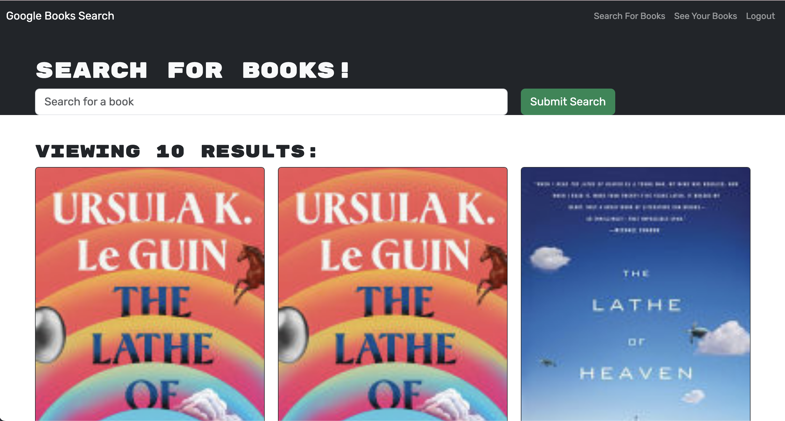

# Book Search Engine

## Description
This app was created as a way to query and save information abouts books provided by the Google Book API. I learned how to develop and deploy and MERN stack app in this process.

## Table of Contents
- [Book Search Engine](#book-search-engine)
  - [Description](#description)
  - [Table of Contents](#table-of-contents)
  - [Installation](#installation)
  - [Usage](#usage)
  - [License](#license)
  - [Contributing](#contributing)
  - [Tests](#tests)
  - [Preview](#preview)
  - [Questions](#questions)

## Installation
To develop this project on your local machine, clone the repo, and run npm install to install all dependencies.

## Usage
Visit the deployed app [here](https://murmuring-fortress-34045.herokuapp.com/). Use it to find books and save ones you are interested in.

## License
This project is licensed under the MIT license.  
For more information, please visit [this link](https://opensource.org/licenses/MIT).

## Contributing
Contact me via GitHub to contribute to this project.

## Tests
There are currently no tests available for the Book Search Engine.

## Preview
Here is a preview of a book being searched:

## Questions
Contact me with questions regarding this software or view more of my work at my [GitHub page](https://github.com/jmcavaddy)!
